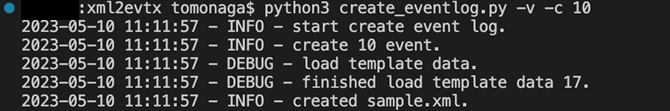

# XML2EVTX

Convert Event Log XML to EVTX file.

## Install

```
$ git clone https://github.com/JPCERTCC/xml2evtx.git
$ cd xml2evtx
$ pip install -r requirements.txt
```

## How to Use

### xml2evtx.py

This tool can convert Event Log XML files exported from Event Viewer or other sources into EVTX files.

```
usage: xml2evtx.py [-h] [-x XML] [-t] [-v]

Convert Windows event log XML to EVTX.

options:
  -h, --help         show this help message and exit
  -x XML, --xml XML  Eventlog XML file.
  -t, --test         Running test.
  -v, --verbose      Show debug logs.
```

  

### create_eventlog.py

This tool can create Event Log XML files with random event IDs.

```
usage: create_eventlog.py [-h] [-f FILE] [-c NUMBER] [-v]

Create random XML event logs.

options:
  -h, --help            show this help message and exit
  -f FILE, --file FILE  Created event log file name. (Default: sample.xml)
  -c NUMBER, --count NUMBER
                        Number of event logs to create.
  -v, --verbose         Show debug logs.
```

  